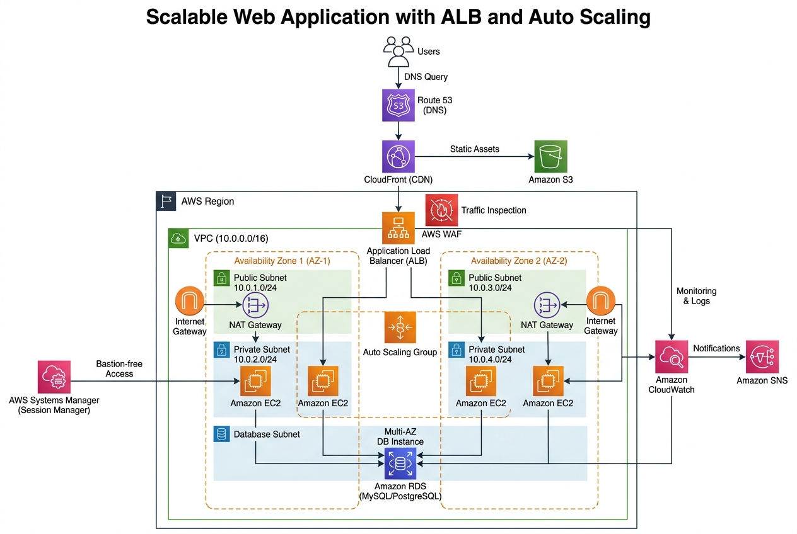

## Table of Contents

- [Solution Overview](#solution-overview)
- [Architecture Diagram](#architecture-diagram)
- [Key AWS Services](#key-aws-services)
- [Prerequisites](#prerequisites)
- [Deployment](#deployment)
  - [1. Clone the Repository](#1-clone-the-repository)
  - [2. Configure Parameters](#2-configure-parameters)
  - [3. Deploy the Stack](#3-deploy-the-stack)
  - [4. Verify the Deployment](#4-verify-the-deployment)
- [Architecture Deep Dive](#architecture-deep-dive)
  - [Networking (VPC)](#networking-vpc)
  - [Compute (EC2 + Auto Scaling)](#compute-ec2--auto-scaling)
  - [Load Balancing (ALB)](#load-balancing-alb)
  - [Security (WAF + Security Groups)](#security-waf--security-groups)
  - [Database (RDS Multi-AZ)](#database-rds-multi-az)
  - [Content Delivery (CloudFront)](#content-delivery-cloudfront)
  - [DNS (Route 53)](#dns-route-53)
  - [Monitoring (CloudWatch + SNS)](#monitoring-cloudwatch--sns)
  - [Secure Access (Systems Manager)](#secure-access-systems-manager)
- [Security](#security)
- [Scaling and Monitoring](#scaling-and-monitoring)
- [Cost Optimization](#cost-optimization)
- [Cleanup](#cleanup)
- [Learning Outcomes](#learning-outcomes)
- [Project Structure](#project-structure)
- [License](#license)

---

# Solution Overview

This solution deploys a **production-grade web application** on AWS using EC2 instances inside a properly architected VPC with public and private subnets across **two Availability Zones**. It achieves high availability and scalability with an **Application Load Balancer (ALB)**, **Auto Scaling Group (ASG)**, and an **Amazon CloudFront** distribution for caching static assets. A **Multi-AZ RDS** instance serves as the database backend, with all compute resources placed in private subnets for enhanced security.

The entire infrastructure is defined as **Infrastructure as Code (IaC)** using AWS CloudFormation, enabling repeatable, version-controlled deployments.

### Key Highlights

| Feature | Implementation |
|---|---|
| **High Availability** | Multi-AZ deployment across 2 Availability Zones |
| **Scalability** | Auto Scaling Group with target tracking and step scaling policies |
| **Security** | WAF (OWASP Top 10), private subnets, Security Groups, NACLs |
| **Content Delivery** | CloudFront CDN with S3 origin for static assets |
| **Database** | RDS Multi-AZ with automated failover and backups |
| **Monitoring** | CloudWatch dashboards, alarms, and SNS notifications |
| **Secure Access** | AWS Systems Manager Session Manager (no bastion hosts) |
| **DNS** | Route 53 with alias records and health checks |
| **IaC** | Fully automated deployment via CloudFormation |

---

# Architecture Diagram



The architecture consists of the following layers:

1. **Edge Layer**: Route 53 for DNS resolution → CloudFront for global CDN and caching
2. **Security Layer**: AWS WAF inspects incoming traffic for OWASP Top 10 threats
3. **Load Balancing Layer**: ALB distributes traffic across EC2 instances in multiple AZs
4. **Compute Layer**: EC2 instances in an Auto Scaling Group within private subnets
5. **Data Layer**: RDS Multi-AZ MySQL/PostgreSQL in isolated database subnets
6. **Monitoring Layer**: CloudWatch metrics/alarms + SNS notifications
7. **Management Layer**: Systems Manager Session Manager for bastion-free access

---

# Key AWS Services

| Service | Purpose |
|---|---|
| **Amazon VPC** | Isolated network with public & private subnets, NAT Gateway, Security Groups, NACLs |
| **Amazon EC2 + ASG** | Compute instances with Launch Template and scaling policies (target tracking) |
| **ALB + WAF** | Layer 7 load balancing with WAF rules for OWASP Top 10 protection |
| **Amazon CloudFront** | Global CDN to cache static assets and reduce latency |
| **Amazon RDS Multi-AZ** | MySQL/PostgreSQL database with automated failover |
| **Amazon Route 53** | DNS with alias records pointing to ALB and health checks |
| **AWS Systems Manager** | Session Manager for secure, bastion-free instance access |
| **Amazon CloudWatch + SNS** | Dashboards, metric alarms, and email/SMS notifications |
| **Amazon S3** | Static asset storage with CloudFront integration |

---

# Prerequisites

Before deploying this solution, ensure you have the following:

- **AWS Account** with appropriate IAM permissions ([required permissions](docs/security.md#iam-permissions))
- **AWS CLI v2** installed and configured ([Install Guide](https://docs.aws.amazon.com/cli/latest/userguide/getting-started-install.html))
- **Git** installed ([Install Guide](https://git-scm.com/downloads))
- An **AWS Region** with at least 2 Availability Zones
- _(Optional)_ A registered domain in Route 53 or another DNS provider
- _(Optional)_ An ACM certificate for HTTPS

---

# Deployment

## 1. Clone the Repository

```bash
git clone https://github.com/mohamedmnmn/Scalable-Web-Application-with-ALB-and-Auto-Scaling.git
cd Scalable-Web-Application-with-ALB-and-Auto-Scaling
```

## 2. Configure Parameters

Review and customize the deployment parameters in the CloudFormation template:

| Parameter | Default | Description |
|---|---|---|
| `EnvironmentName` | `Production` | Environment name prefix for all resources |
| `VpcCIDR` | `10.0.0.0/16` | CIDR block for the VPC |
| `PublicSubnet1CIDR` | `10.0.1.0/24` | CIDR for public subnet in AZ-1 |
| `PublicSubnet2CIDR` | `10.0.2.0/24` | CIDR for public subnet in AZ-2 |
| `PrivateSubnet1CIDR` | `10.0.3.0/24` | CIDR for private subnet in AZ-1 |
| `PrivateSubnet2CIDR` | `10.0.4.0/24` | CIDR for private subnet in AZ-2 |
| `DBSubnet1CIDR` | `10.0.5.0/24` | CIDR for database subnet in AZ-1 |
| `DBSubnet2CIDR` | `10.0.6.0/24` | CIDR for database subnet in AZ-2 |
| `InstanceType` | `t3.micro` | EC2 instance type |
| `DBInstanceClass` | `db.t3.micro` | RDS instance class |
| `DBName` | `webappdb` | Database name |
| `DBUser` | `admin` | Database admin username |
| `DBPassword` | _(required)_ | Database admin password (min 8 characters) |
| `DomainName` | _(optional)_ | Custom domain name for Route 53 |

## 3. Deploy the Stack

### Option A: Using the deployment script

```bash
chmod +x scripts/deploy.sh
./scripts/deploy.sh --stack-name scalable-web-app --environment Production --db-password YourSecurePassword123!
```

### Option B: Using AWS CLI directly

```bash
aws cloudformation create-stack \
  --stack-name scalable-web-app \
  --template-body file://templates/main.yaml \
  --parameters \
    ParameterKey=EnvironmentName,ParameterValue=Production \
    ParameterKey=DBPassword,ParameterValue=YourSecurePassword123! \
  --capabilities CAPABILITY_IAM \
  --region us-east-1
```

### Option C: Using the AWS Console

1. Navigate to **CloudFormation** in the AWS Console
2. Click **Create Stack** → **With new resources**
3. Upload `templates/main.yaml`
4. Fill in the parameters
5. Acknowledge IAM capabilities
6. Click **Create Stack**

> ⏱ **Deployment Time**: Approximately 15-25 minutes

## 4. Verify the Deployment

After the stack reaches `CREATE_COMPLETE` status:

```bash
# Get the ALB DNS name
aws cloudformation describe-stacks \
  --stack-name scalable-web-app \
  --query "Stacks[0].Outputs[?OutputKey=='ALBDNSName'].OutputValue" \
  --output text

# Or run the validation script
chmod +x scripts/validate.sh
./scripts/validate.sh --stack-name scalable-web-app
```

Open the ALB DNS name in your browser to verify the application is running.

---

# Architecture Deep Dive

## Networking (VPC)

The VPC is designed with a **three-tier subnet architecture** across two Availability Zones:

```
VPC (10.0.0.0/16)
├── Public Subnets (ALB, NAT Gateways)
│   ├── AZ-1: 10.0.1.0/24
│   └── AZ-2: 10.0.2.0/24
├── Private Subnets (EC2 Instances)
│   ├── AZ-1: 10.0.3.0/24
│   └── AZ-2: 10.0.4.0/24
└── Database Subnets (RDS)
    ├── AZ-1: 10.0.5.0/24
    └── AZ-2: 10.0.6.0/24
```

- **Internet Gateway** provides internet access for public subnets
- **NAT Gateways** (one per AZ) enable outbound internet for private subnets
- **Route Tables** are configured per subnet tier with proper routing
- **NACLs** provide subnet-level stateless firewall rules

## Compute (EC2 + Auto Scaling)

- **Launch Template**: Amazon Linux 2023 AMI with user data for automated application setup
- **Auto Scaling Group**: Min 2 / Max 6 / Desired 2 instances across 2 AZs
- **Target Tracking Policy**: Maintains average CPU utilization at 70%
- **Step Scaling Policy**: Additional scaling steps for rapid traffic spikes
- **IAM Instance Profile**: SSM-enabled role for bastion-free access

## Load Balancing (ALB)

- **Application Load Balancer** in public subnets across both AZs
- **Target Group** with health checks (`/` path, 30s interval, 5s timeout)
- **HTTP Listener** on port 80 forwarding to the target group
- Cross-zone load balancing enabled

## Security (WAF + Security Groups)

### Security Groups (Stateful)

| Security Group | Inbound Rules | Purpose |
|---|---|---|
| ALB SG | TCP 80, 443 from `0.0.0.0/0` | Accept web traffic |
| EC2 SG | TCP 80 from ALB SG only | Accept traffic only from ALB |
| RDS SG | TCP 3306 from EC2 SG only | Accept DB connections from app tier |

### WAF Rules

- **AWS Managed Common Rule Set** — Protection against common web exploits
- **SQL Injection Rule Set** — Blocks SQLi attack patterns
- **Rate-based Rule** — Limits requests per IP to prevent DDoS

### Network ACLs

- Configured for each subnet tier with explicit allow/deny rules
- Provides an additional layer of defense at the subnet boundary

For complete security documentation, see [docs/security.md](docs/security.md).

## Database (RDS Multi-AZ)

- **Engine**: MySQL 8.0
- **Multi-AZ**: Automated failover to standby instance
- **Backups**: Automated with 7-day retention
- **Encryption**: Storage encrypted at rest
- **Subnet Group**: Deployed in isolated database subnets
- **Access**: Only from EC2 Security Group on port 3306

## Content Delivery (CloudFront)

- **Distribution** with ALB as the primary origin
- **S3 bucket** as the secondary origin for static assets (images, CSS, JS)
- **Cache Behaviors**: Optimized caching policies for dynamic and static content
- **Price Class**: PriceClass_100 (North America and Europe)

## DNS (Route 53)

- **Hosted Zone** created when a domain name is provided
- **Alias Record** pointing to the ALB
- **Health Checks** monitoring ALB endpoint availability

## Monitoring (CloudWatch + SNS)

- **CloudWatch Dashboard** with key metrics:
  - ALB request count and latency
  - EC2 CPU utilization across the ASG
  - RDS connections and read/write latency
  - Healthy/unhealthy host counts
- **Alarms**:
  - High CPU utilization (> 80% for 5 minutes)
  - Unhealthy target count (> 0 for 5 minutes)
  - 5xx error rate (> 5% for 5 minutes)
- **SNS Topic** for alarm notifications (email)

For detailed monitoring documentation, see [docs/scaling-and-monitoring.md](docs/scaling-and-monitoring.md).

## Secure Access (Systems Manager)

- **Session Manager** enables secure shell access to EC2 instances
- **No bastion hosts** required — reduces attack surface and cost
- All sessions are logged to CloudWatch Logs for auditing
- IAM-based access control

---

# Security

This solution implements defense-in-depth security:

- ✅ All compute instances in **private subnets** (no public IPs)
- ✅ **WAF** with OWASP Top 10 protection on the ALB
- ✅ **Security Groups** with least-privilege access between tiers
- ✅ **NACLs** for subnet-level network filtering
- ✅ **RDS encryption** at rest and in transit
- ✅ **Session Manager** for bastion-free, audited access
- ✅ **IAM roles** with minimum required permissions

For the full security guide, see [docs/security.md](docs/security.md).

---

# Scaling and Monitoring

The Auto Scaling Group is configured with two scaling policies:

1. **Target Tracking**: Automatically adjusts capacity to maintain 70% average CPU utilization
2. **Step Scaling**: Adds instances in steps when CPU exceeds defined thresholds

CloudWatch provides full observability with pre-configured dashboards and alarms.

For the full scaling and monitoring guide, see [docs/scaling-and-monitoring.md](docs/scaling-and-monitoring.md).

---

# Cost Optimization

| Component | Estimated Monthly Cost (us-east-1) |
|---|---|
| EC2 (2x t3.micro) | ~\$15.00 |
| RDS (db.t3.micro Multi-AZ) | ~\$25.00 |
| ALB | ~\$16.20 |
| NAT Gateway (2x) | ~\$65.00 |
| CloudFront | ~\$1.00 (low traffic) |
| S3 | < \$1.00 |
| WAF | ~\$6.00 |
| Route 53 | ~\$0.50 |
| **Total (estimated)** | **~\$130/month** |

> 💡 For cost optimization strategies (Reserved Instances, single NAT Gateway, etc.), see [docs/cost-optimization.md](docs/cost-optimization.md).

---

# Cleanup

To avoid ongoing charges, delete the stack when no longer needed:

### Using the cleanup script

```bash
chmod +x scripts/cleanup.sh
./scripts/cleanup.sh --stack-name scalable-web-app
```

### Using AWS CLI

```bash
# Empty S3 buckets first
aws s3 rm s3://$(aws cloudformation describe-stack-resource --stack-name scalable-web-app --logical-resource-id StaticAssetsBucket --query 'StackResourceDetail.PhysicalResourceId' --output text) --recursive

# Delete the stack
aws cloudformation delete-stack --stack-name scalable-web-app

# Wait for deletion
aws cloudformation wait stack-delete-complete --stack-name scalable-web-app
```

---

# Learning Outcomes

By deploying and studying this solution, you will learn to:

- ✅ Design VPCs with correct subnet, route table, and NAT Gateway configurations
- ✅ Build highly available architectures across multiple Availability Zones
- ✅ Configure ALB listener rules and target group health checks
- ✅ Implement Auto Scaling with target tracking and step scaling policies
- ✅ Secure applications with WAF, Security Groups, and private subnets
- ✅ Use Systems Manager Session Manager as a bastion-free access alternative
- ✅ Set up CloudWatch monitoring with dashboards, alarms, and SNS notifications
- ✅ Deploy infrastructure as code using AWS CloudFormation

---

# Project Structure

```
Scalable-Web-Application-with-ALB-and-Auto-Scaling/
│
├── README.md                          # This file — project overview and documentation
├── architecture-diagram.jpg           # Solution architecture diagram
├── LICENSE                            # Apache 2.0 License
├── CONTRIBUTING.md                    # Contributing guidelines
├── CHANGELOG.md                       # Release changelog
├── CODE_OF_CONDUCT.md                 # Code of conduct
├── NOTICE.txt                         # Notice file
├── .gitignore                         # Git ignore rules
│
├── templates/                         # CloudFormation templates
│   ├── main.yaml                      # Main stack — full infrastructure
│   └── vpc.yaml                       # VPC-only nested stack
│
├── scripts/                           # Deployment & management scripts
│   ├── deploy.sh                      # Automated deployment script
│   ├── cleanup.sh                     # Stack deletion and cleanup
│   └── validate.sh                    # Post-deployment validation
│
└── docs/                              # Extended documentation
    ├── deployment-guide.md            # Step-by-step deployment guide
    ├── security.md                    # Security architecture documentation
    ├── scaling-and-monitoring.md      # Scaling and monitoring guide
    └── cost-optimization.md           # Cost analysis and optimization
```


# License

This project is licensed under the Apache License 2.0 — see the [LICENSE](LICENSE) file for details.

---

_Copyright © 2024 — Scalable Web Application with ALB and Auto Scaling_
